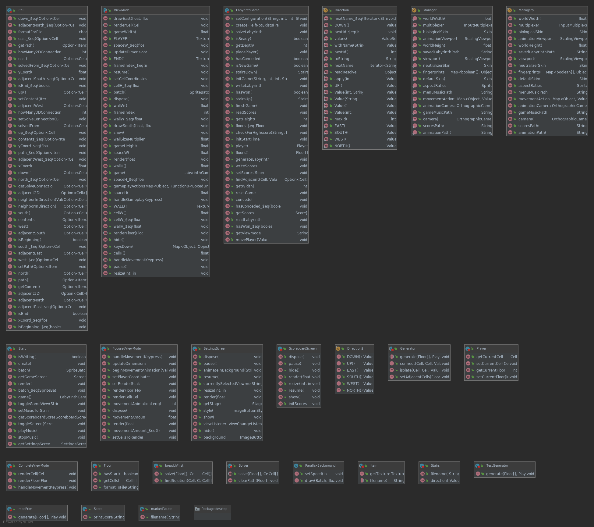

# Labyrinth

**NOTE: Repository cloned from GitLab, commit history not available on GitHub**  
https://plus.cs.aalto.fi/studio_2/k2020/studioprojekti/101/  

Framework used: https://libgdx.badlogicgames.com/  
Original fork: https://github.com/LOFI/gdx-scala-demo  

ParallaxBackground.java originally written by Julien Villegas (https://github.com/julienvillegas/libgdx.info-Parallax) as part of a sample series on https://libgdx.info/

Skins:  
"default"  
"neutralizer", Credit to Raymond "Raeleus" Buckley (https://github.com/czyzby/gdx-skins/tree/master/biological-attack), CC BY 4.0  
"biological-attack", Credit to Raymond "Raeleus" Buckley (https://github.com/czyzby/gdx-skins/tree/master/biological-attack), CC BY 4.0  
Also many thanks for bundling all these skins and more to this repository of LibGDX skins: https://github.com/czyzby/gdx-skins  

Music:  
"Doctor Gadget"  
"Chamber of Secrets"   
All music is distrubted by playonloop.com, Licensed under Creative Commons by Attribution 4.0

**NOTE**: If you want to lower the restrictions on the sizes of labyrinths, you accomplish this by altering the MAX-values in core/src/gdx/scala/labyrinth/Manager.scala

**Building from source**:  
Due to Scala's unorthodox ways of handling installation, the project can be built in a multitude of ways.  
The easiest way is through gradle, and this is made even easier through the gradle wrapper bundled in the repository.  
Note that building will still require you to download gradle (more specifically the file at https://services.gradle.org/distributions/gradle-4.8.1-all.zip),
so you'll need a few bytes of spare storage.  

Types of systems tested:  

1:  
	Windows 10  
	IntelliJ IDEA version 2019.2 and 2020.1 with Scala- and Gradle-plugins  
	(Java 8 update 151)

2: 	Windows 10
	OpenJDK version 8 update 222

3:  
	Ubuntu 16  
	OpenJDK version 8 update 242  

Step-by-step instructions to building from source using these systems:

1:
Open IntelliJ IDEA  
(if no projects were open just click import in the introductory window and skip the following line)  
File -> New -> Project from existing sources  
Select project's repository  
Import project from external model -> Gradle -> Finish  
View -> Tool windows -> Gradle -> Click on Gradle-logo in the new window (to the right from the refresh-symbol)  
Type in "gradle desktop:dist desktop:run"  
This will build the jar and run it  

2 & 3:  
Navigate to root of project in terminal  
"./gradlew desktop:dist desktop:run"  

NOTE: After both of these builds the game can be run by simply executing the jar found at ./desktop/build/libs

If you wish to bundle a JRE with the build, you can accomplish this by using Packr. The full instructions for the tool can be pieced together starting from here: https://github.com/libgdx/packr  
The general idea for using the tool with this project (on a Linux machine) when building for machines running Windows should look something like this:  
java -jar /path/to/packr.jar --platform windows64 --jdk /path/to/JDK.zip --executable labyrinthGame --classpath desktop/build/libs/desktop-1.0.jar --removelibs desktop-1.0.jar --mainclass gdx.scala.labyrinth.desktop.DesktopLauncher --vmargs Xmx1G --resources desktop/assets --minimizejre soft --output out-win64

  